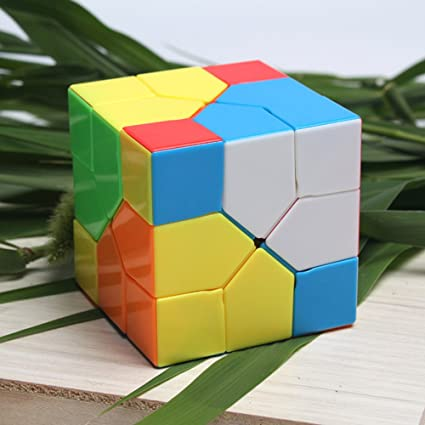
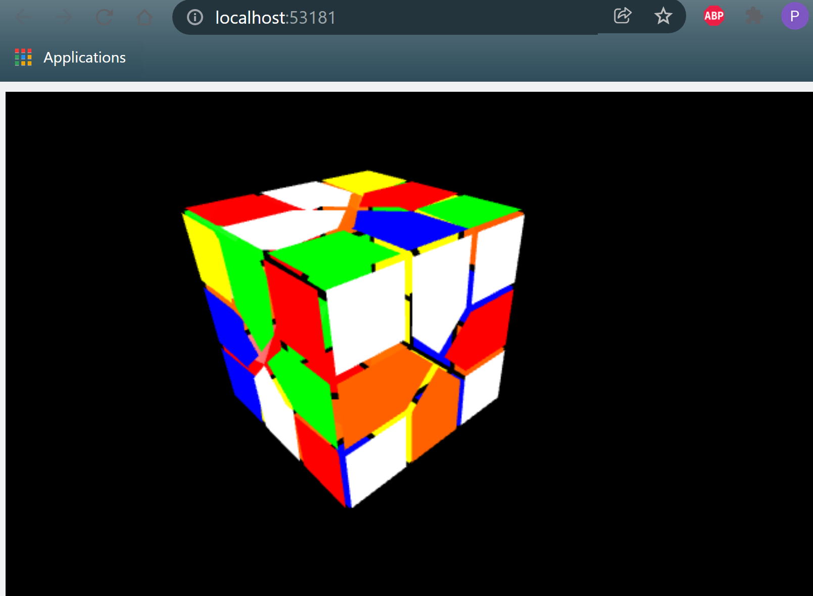

<h1 align="center">
  
</h1>

---

# RESOLUTION EXHAUSTIVE D’UN REDICUBE

## Petit résumé

- Conçu par Oskar Van Deventer en 2009 et publié par MoYu début juin 2017, le Redi Cube est une variante du Rubik's Cube à trois couches sur lequel chaque virage déplace les trois bords l'entourant.

## Objectifs

- Trouver le nombre de dieux du Redi Cube (nombre de mouvements maximum pour résoudre toutes les positions initiales possibles).
- Réaliser un algorithme de résolution.

## Techno

- Python
- Spyder

## UI

## Auteur

- [@Owen](https://github.com/owen974)
- [@Pierre](https://github.com/Pierre-Portfolio)
- [@OeTroV](https://github.com/OeTroV)
